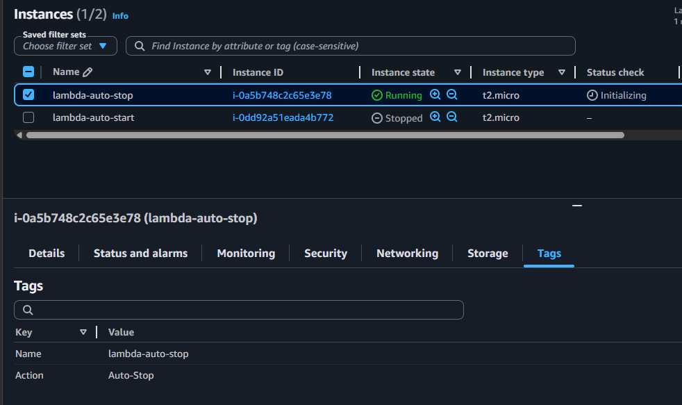
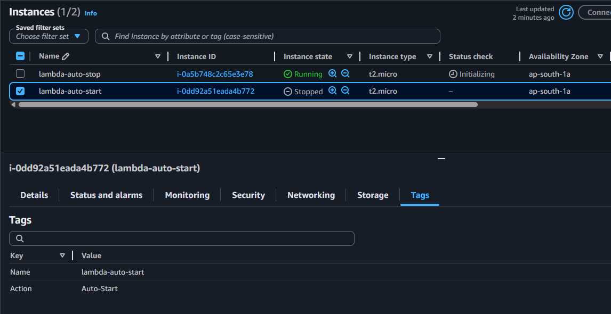
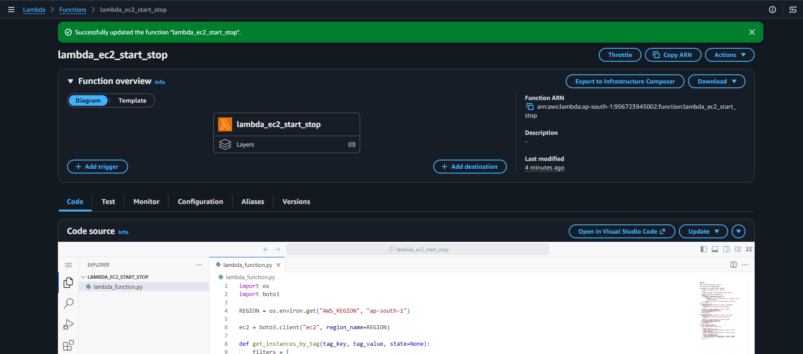
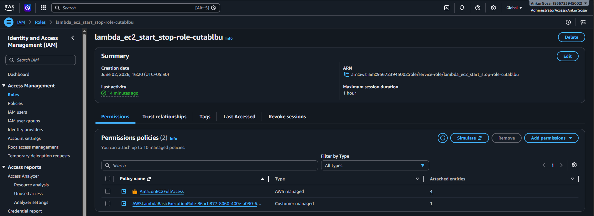
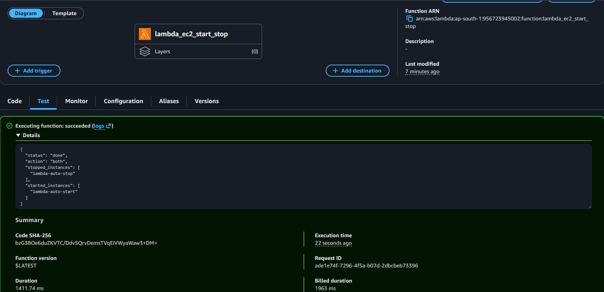
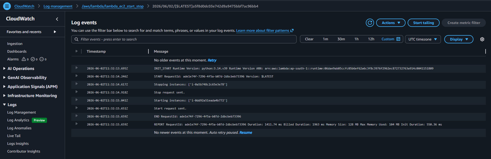
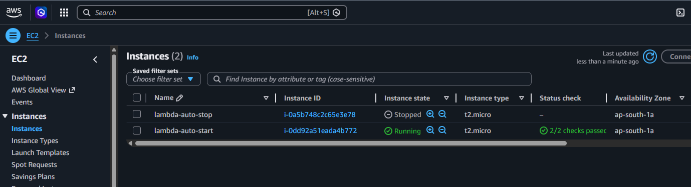

# Assignment 1: Automated Instance Management with AWS Lambda and Boto3

  
   
  <em>Instance Running with Action=Auto-Stop</em>

  
   
  <em>Instance Stopped with Action=Auto-Start</em>

  
   
  <em>Lambda Function</em>

### Lambda function code: [lambda_function.py](lambda_function.py)

  
   
  <em>Provided EC2 Access to Lambda Execution IAM Role</em>

  
   
  <em>Manual Invocation of Lambda Function</em>

  
   
  <em>CloudWatch Logs for the manual invocation</em>

  
   
  <em>EC2 Instance State after Lambda Function Execution</em>

