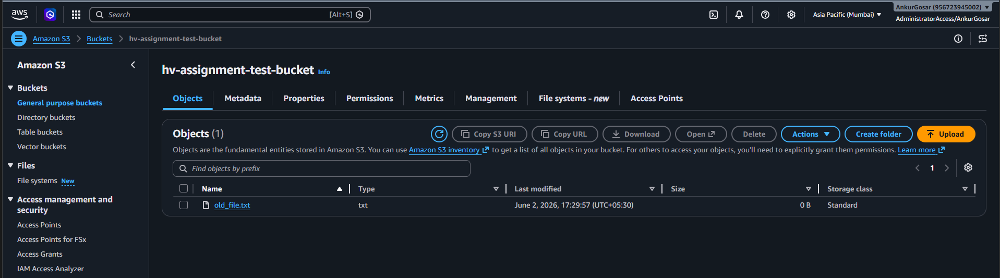
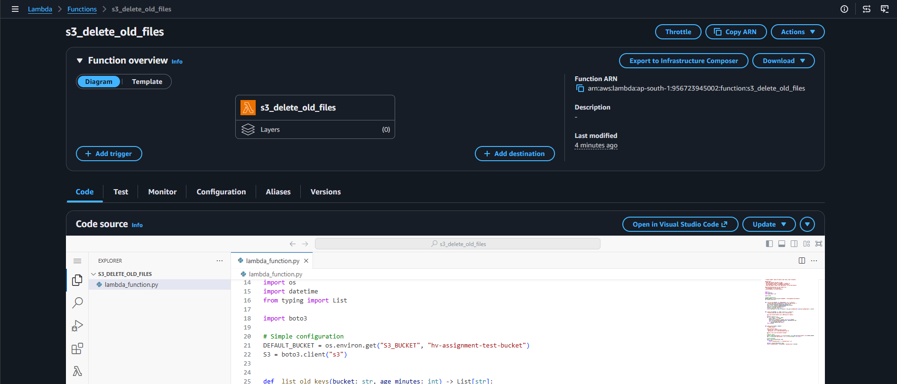
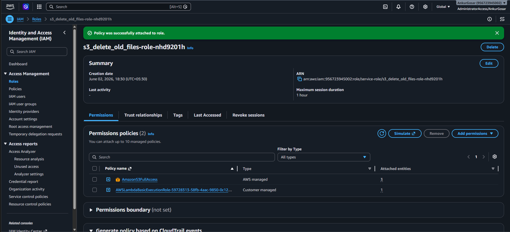
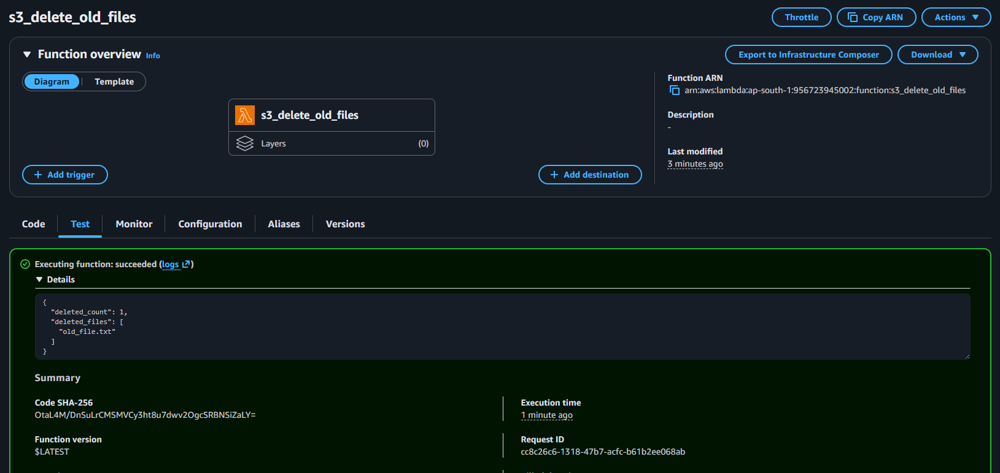
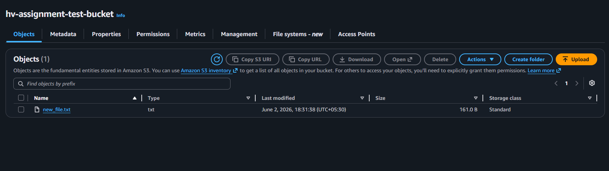
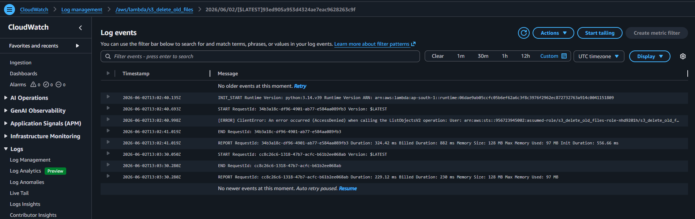

  
   
  <em>Old file uploaded to S3 bucket</em>

    
     
    <em>Lambda function code</em>

### Lambda function code: [lambda_function.py](lambda_function.py)

    
     
    <em>Adding S3 access Permission policy to Lambda Execution IAM Role</em>

### Note:
There is no way to upload a file which AWS will consider as 30 days old. So I kept the timeout as 5 mins so that I can run the Lambda function and it will delete the file older than 5 mins.

    
     
    <em>Lambda manual invocation</em>

    
     
    <em>Old file deleted from S3 bucket after Lambda execution</em>

    
     
    <em>CloudWatch Logs</em>

