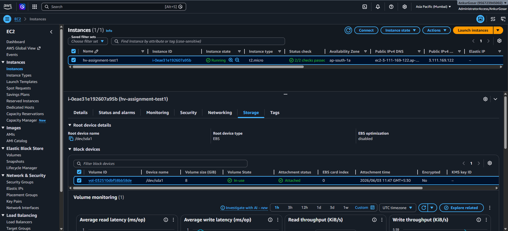
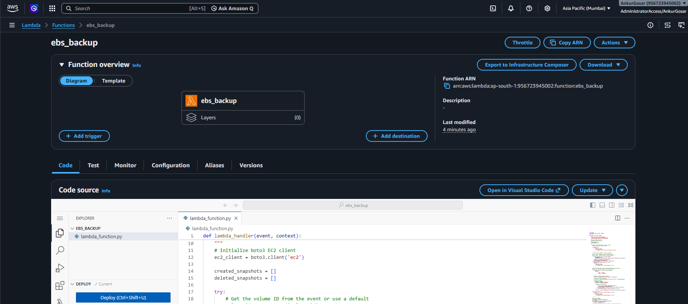
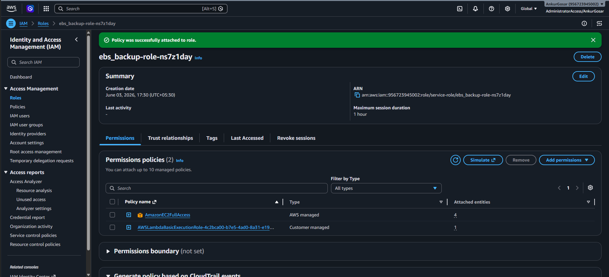
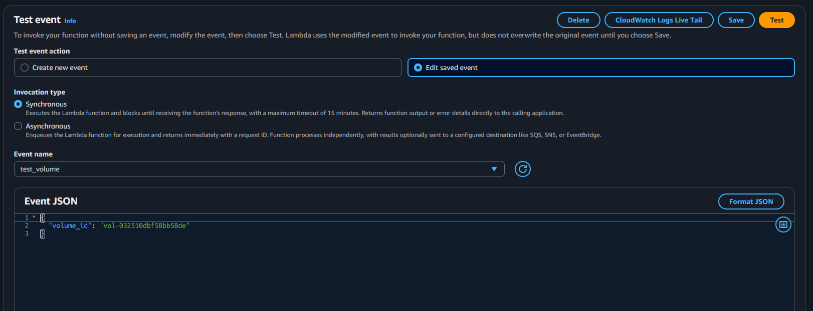
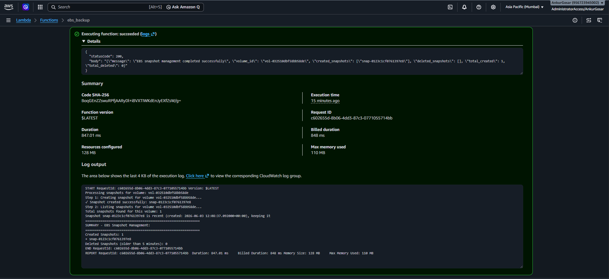
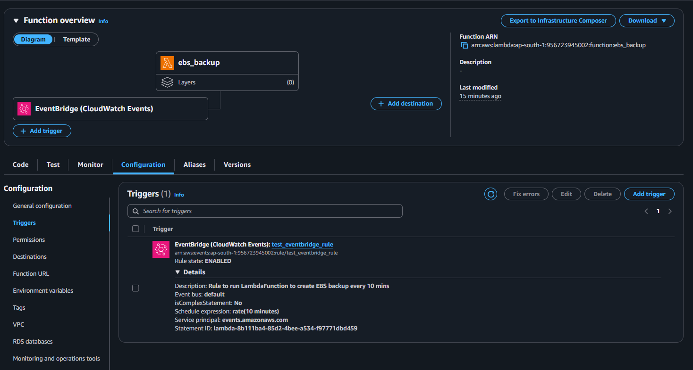
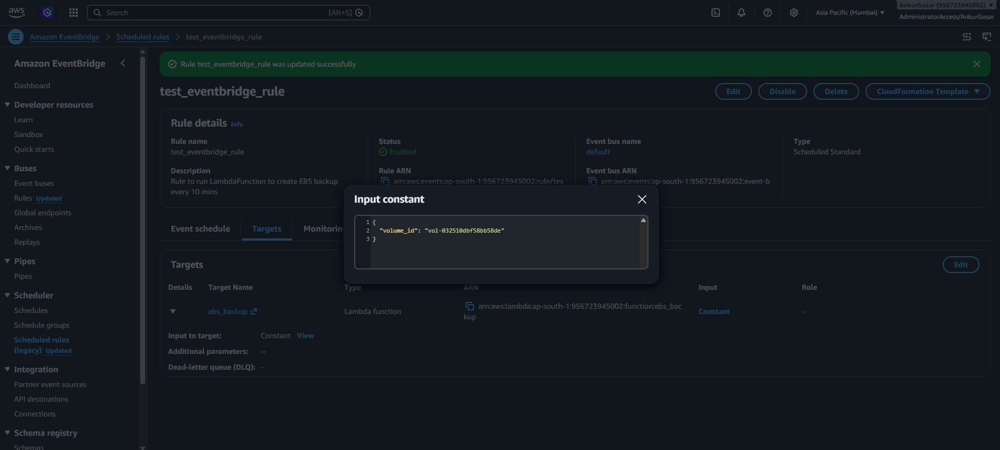
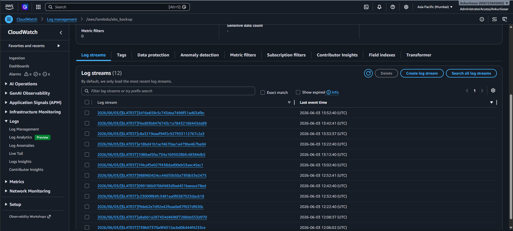
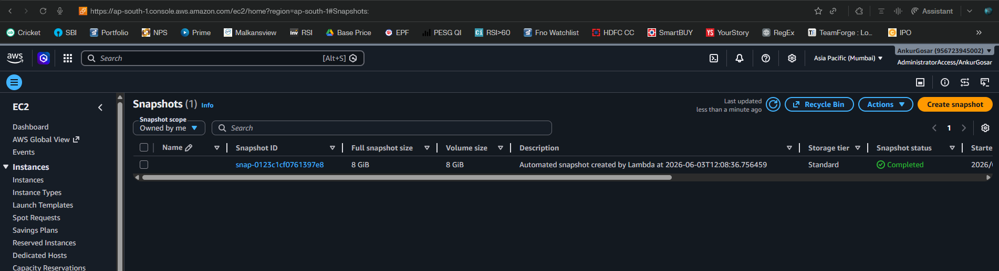
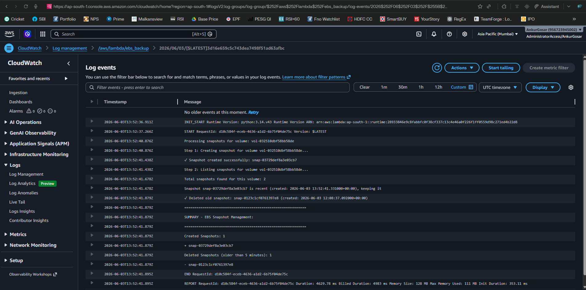

    
     
    <em>EC2 instance with Volume ID</em>

### Note:
Configured the Lambda function to delete snapshots older than 5 mins for test and demonstration purposes. It is not practically possible to wait for 30 days to complete this assignment.

    
     
    <em>Lambda function</em>

### Lambda function code: [lambda_function.py](lambda_function.py)

    
     
    <em>Provided EC2 permissions to the Lambda Execution IAM Role</em>

    
     
    <em>Test event created to provide Volume ID as input</em>

    
     
    <em>First invocation done manually</em>

    
     
    <em>Added an EventBridge trigger to run the Lambda Function every 10 mins</em>

### Note
The initial invocations of the Lambda was not showing any input. Later realized that need to configure the input for the trigger. Once done, the Lambda execution started showing results.

    
     
    <em>Configured the EventBridge trigger with the specified Volume ID as input</em>

    
     
    <em>Lambda invocation happening automatically every 10 mins</em>

    
     
    <em>Automatically created Snapshot by Lambda</em>

    
     
    <em>CloudWatch Logs: Created new snapshot and deleted old one since it was older than 5 mins</em>

