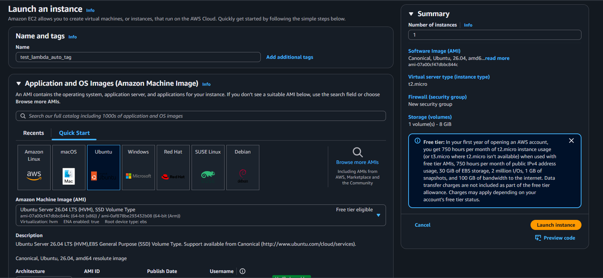
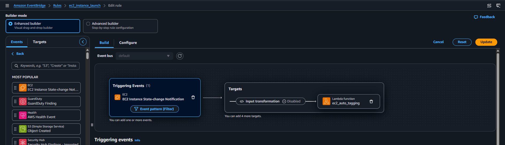
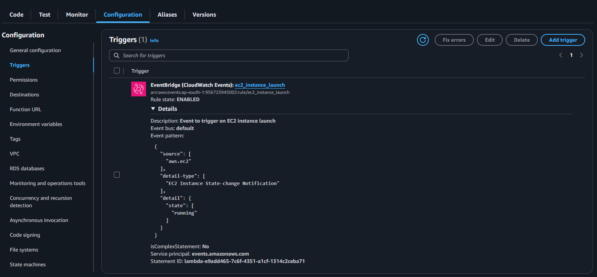
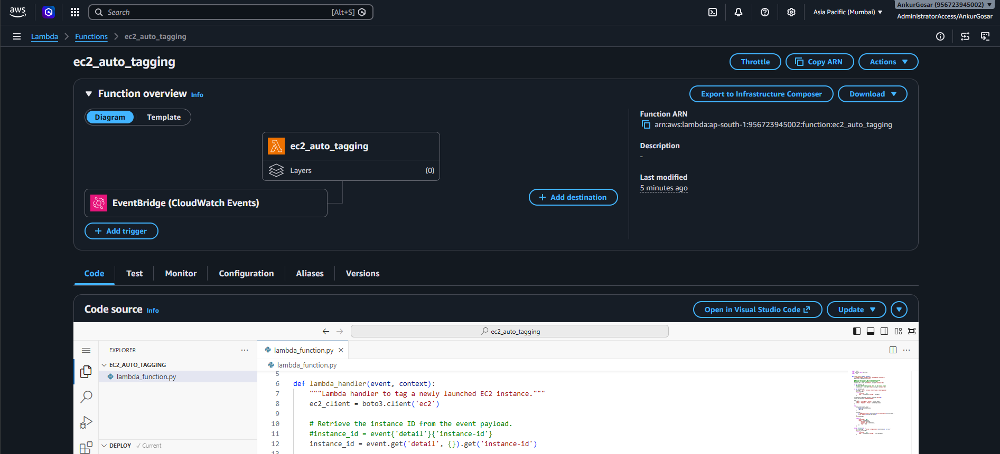
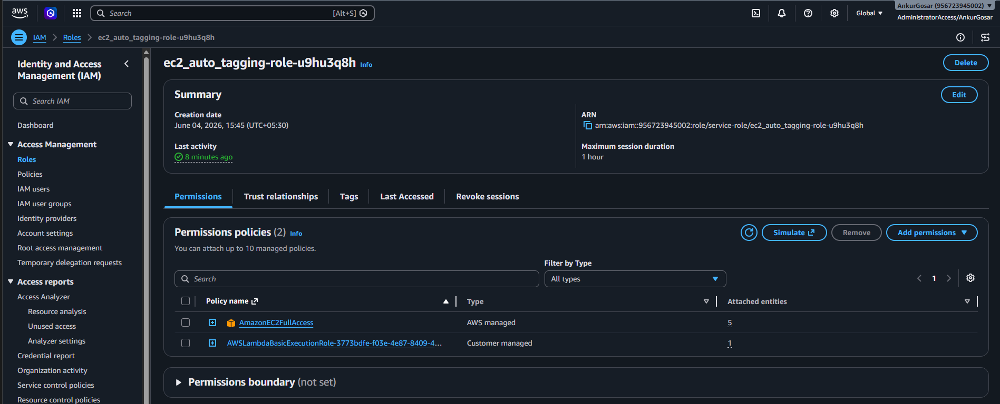
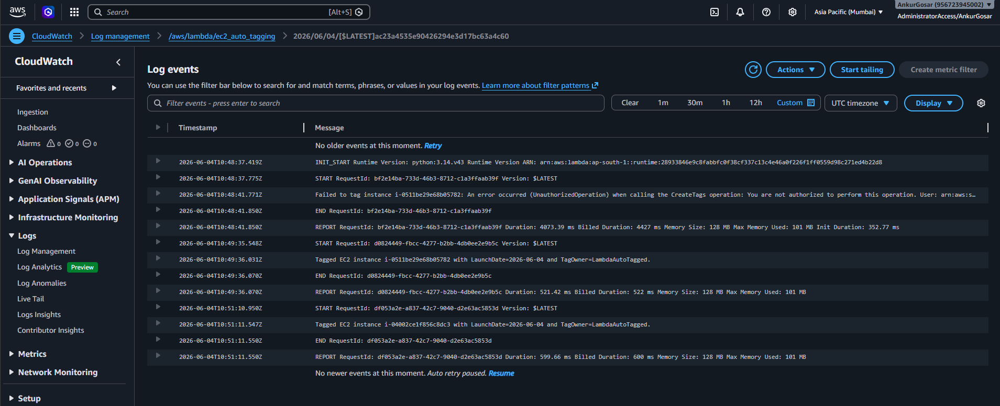
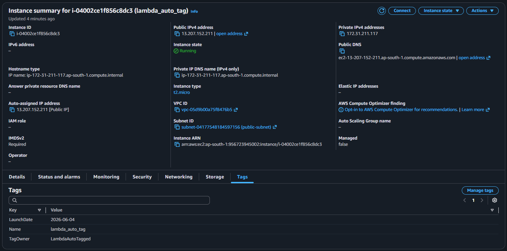
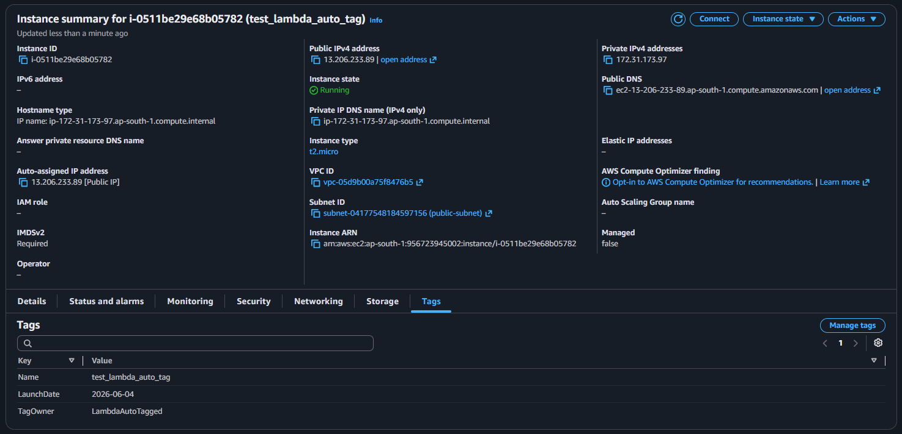

# Assignment 5: Auto-Tagging EC2 Instances on Launch Using AWS Lambda and Boto3

    
     
    <em>Creating an EC2 instance without any tags</em>

    
     
    <em>Configuring the CloudWatch Event Trigger</em>

    
     
    <em>CloudWatch Event Trigger</em>

    
     
    <em>Lambda function with CloudWatch Event Trigger</em>

### Lambda function code: [lambda_function.py](lambda_function.py)

    
     
    <em>Adding EC2FullAccess permission to Lambda IAM Execution Role</em>

    
     
    <em>CloudWatch Logs showing the Tagging of EC2 instances</em>

    
     
    <em>EC2 instance tags</em>

    
     
    <em>EC2 instance tags</em>

