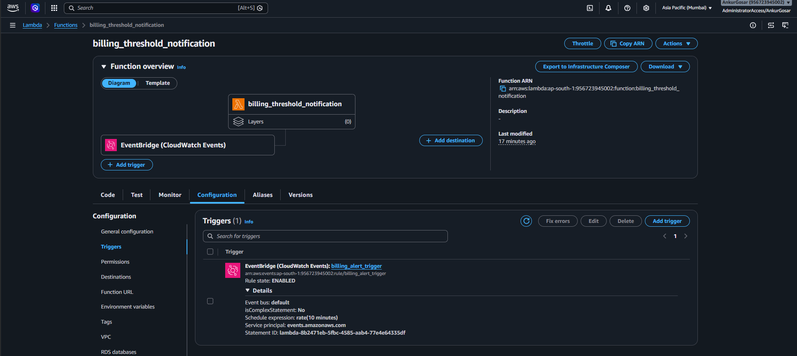
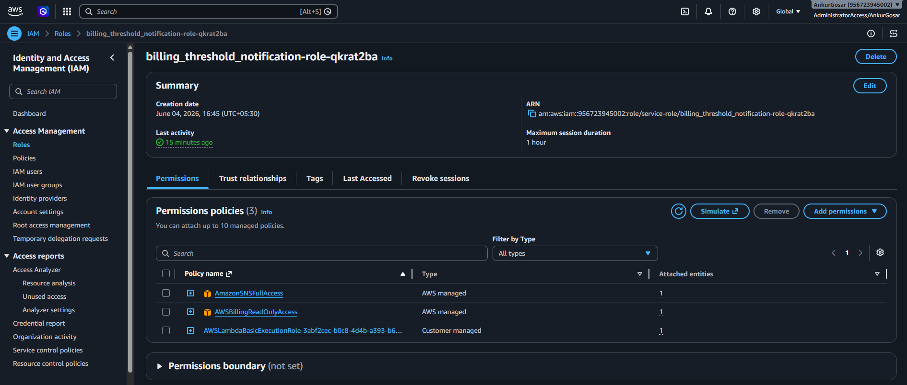
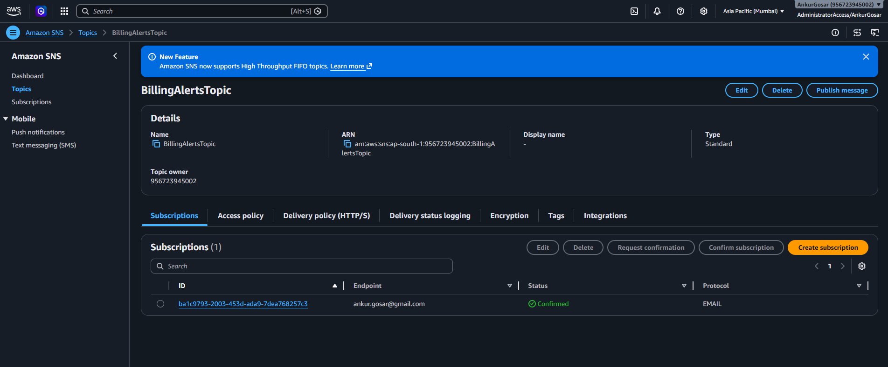
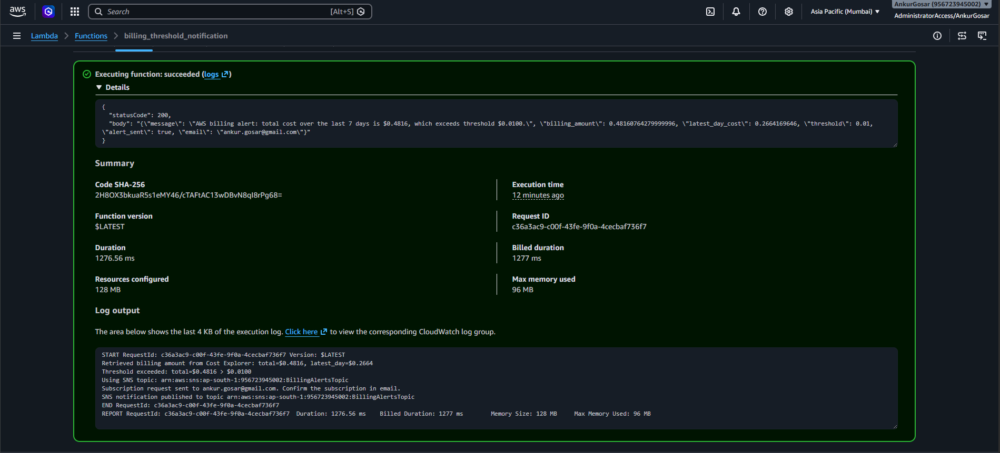
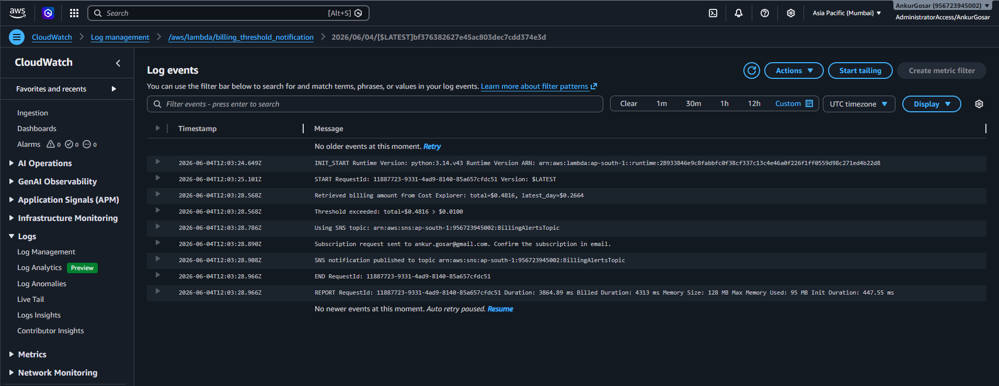
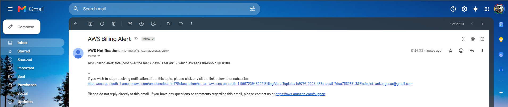

# Assignment 6: Monitor and Alert High AWS Billing Using AWS Lambda, Boto3, and SNS

    
     
    <em>Lambda Function with CloudWatch Events Trigger to run every 10 mins</em>

### Lambda function code: [lambda_function.py](lambda_function.py)

    
     
    <em>Provided Billing and SNS Permissions to Lambda execution IAM Role</em>

    
     
    <em>Billing Alerts Topic created by Lambda</em>

    
     
    <em>Test execution</em>

    
     
    <em>CloudWatch Logs</em>

    
     
    <em>Billing alert Email received</em>

